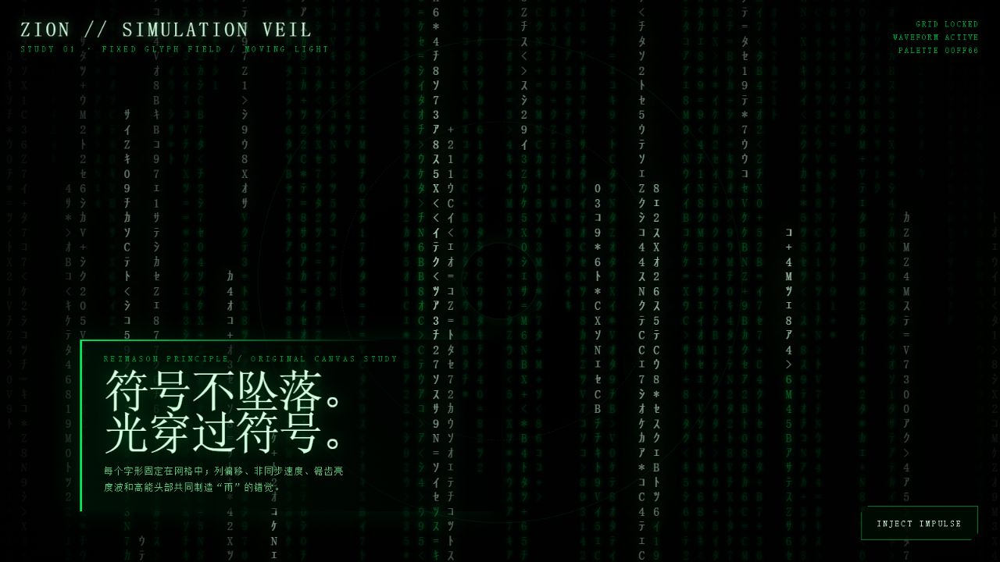
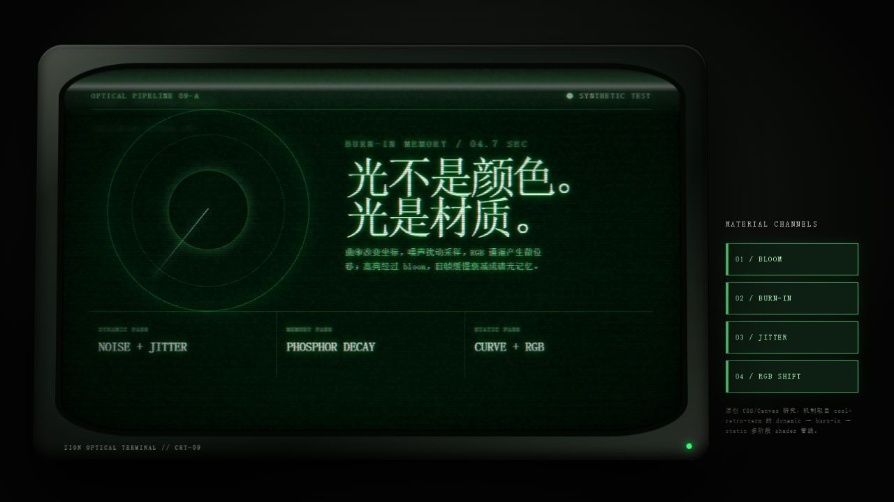
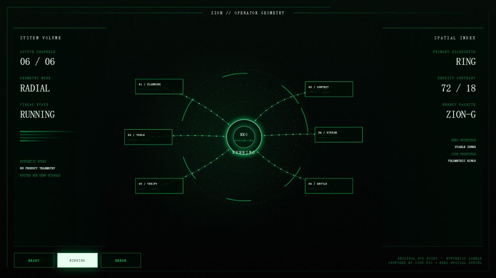

# DESIGN.md — ZION 视觉设计宪章

> 状态：Active / 项目级视觉单一事实源
>
> 适用：任何新界面、视觉重构、动效、声音、品牌素材和 UI 原型
>
> 目标：让 ZION 成为一台来自《黑客帝国》世界、可真实工作的 Agent 主控台，而不是套了绿色主题的普通 IDE。

## 1. 创作指令

视觉效果是 ZION 的首要产品能力。设计 Agent 必须先创造一个大胆、前卫、令人记住的画面，再在这个世界中组织功能。可以重构旧布局、扩大视觉主角、引入新的空间关系、材质、镜头、动画与声音；现有 demo 是素材和历史，不是构图上限。

每次视觉任务都应满足以下命题：

- 第一眼就能认出这是 ZION；截图不能与 Cursor、VS Code 或通用 SaaS 仪表盘混淆。
- 每个主要视图至少有一个视觉主角和一个可复述的“电影时刻”。
- 视觉变化由真实 Agent 状态驱动，让“系统正在发生什么”可以被看见、听见或感到。
- 信息层与氛围层共同设计。通过局部遮罩、对比、景深和焦点模式保护可读性，而不是全局削弱效果。

旧版“荧光焦点最多两个”“背景效果低于 20%”“动画只能短促位移”等统一配额已经取消。效果强度、数量、持续时间和屏幕占比由当前场景的视觉导演决定，并通过性能与可访问模式分级。

## 2. 文档优先级

1. 用户当前任务、功能规格和 ADR 决定产品行为。
2. 本文决定项目级视觉方向与评审标准。
3. 功能专属视觉文档决定已落地模块的几何和实现细节。例如脑机链路以 `docs/neural-cable-visual.md` 为实现事实源，修改时同步更新。
4. `ui-demo/` 与 `research/` 是参考和证据库，可以继承、重组或超越。

当旧 demo、旧规格与本文冲突时，以本文为准。`design-doc/agent-ui-reference-design.md` 已退出规范角色。

## 3. 北极星：ZION 是一个世界，不是一张皮肤

ZION 的核心想象是“地下人类城邦的生物机械 Agent 控制系统”：

- Matrix 是远处的模拟层：数字雨、字形波、绿色能量和空间深度。
- Zion 是近处的物理层：磨损金属、透明屏、线缆、培育仓、扫描器、脉冲和工业结构。
- Agent 是活的系统：它思考、调度、写入、验证、受阻、恢复和沉降；这些事件应改变整个舞台。
- 用户是操作员：关键控制像真实设备一样有位置、反馈、风险和后果。

优先建立轮廓、空间和状态叙事，然后才是边框、按钮与微装饰。允许非对称、越界、环形、放射、纵深、透视、满屏转场、巨型字、全息投影、局部失真和生物机械形态。

## 4. 六种视觉语法

### 4.1 数字雨不是墙纸，而是模拟层

参考 Rezmason/matrix 的关键结论：字形可以固定在网格中，真正移动的是亮度波；先计算 bloom，再做绿色调色。优秀的数字雨具有：

- 半角片假名、数字、拉丁字符和少量符号组成的专用字形表，可镜像、翻转或按场景换字形。
- 明暗与速度分层，接近白色的高能头部，拖尾、辉光、雾化和大块黑色留白。
- 同列多脉冲、不同步节奏、罕见闪烁与字形突变，而不是每帧整屏随机。
- 2D、体积、倾斜、涟漪、图像显影或空间穿透等变体；雨可以参与叙事，而不只做背景。

### 4.2 Zion 控制室几何

参考《The Matrix Reloaded》的 Zion 屏幕图形：用环形结构、地图拓扑、透明叠层、细线网格、单色体积和局部高亮表达庞大系统。几何可以越过传统卡片边界，将侧栏、主区和状态栏连接为同一台机器。

### 4.3 全屏操作台密度

参考 eDEX-UI：稳定的空间分区、统一字形和一致框架能承载很高的信息密度。屏幕可以像驾驶舱一样被充分利用；密集区与巨大暗场并置，比平均分布更有戏剧性。主题换色时保留结构语法，而不是把品牌等同于一种绿色。

### 4.4 CRT 是材质管线

参考 cool-retro-term：CRT 感来自多层光学和物理效应的组合，包括 bloom、余辉、烧屏、静电噪声、抖动、扫描亮线、曲率、同步偏移、RGB 分离、边框反光和环境光。把这些能力做成可组合的渲染层或预设，不要退化为一张扫描线贴图。

### 4.5 电影级 FUI

参考 Blade Runner 2049、TRON: Legacy 与 Oblivion：

- Blade Runner 2049：旧硬件、灰尘、低分辨率、机械反馈与精密信息共存。
- TRON: Legacy：黑场中的发光几何、尺度、节奏和空间连续性。
- Oblivion：克制的环形导航、细线数据、冷白/淡青发光与清晰负空间。
- Zion UI：抽象图形可以先传递系统规模与危险，再让文字完成精确解释。

借用构图原则、材质和节奏，不复制受版权保护的具体画面、字形或素材。

### 4.6 生物机械链路

会话培育仓、Neo、神经线缆、蠕虫和写入脉冲属于同一套“活体基础设施”。线缆应有呼吸、蠕动、传导、压力、受伤与恢复感；端点位置和方向表达真实关系。装饰动画可以持续存在，状态动画必须更加明确并拥有开始、峰值与余波。

## 5. 构图原则

### 5.1 每屏一个视觉主角

主角可以是 Neo、培育仓、一次工具写入、任务拓扑、巨型状态字、扩散波或空间化代码差异。次要区域主动让出亮度、运动、尺度或清晰度。

### 5.2 用深度组织，而不只用矩形

至少考虑三个平面：

- 远景：数字雨、雾、城市网格、低频空间运动。
- 中景：线路、拓扑、全息面板、任务轨迹和环境响应。
- 近景：输入、确认、错误、代码差异和当前操作目标。

DOM 负责信息与操作；Canvas、SVG、WebGL 和滤镜负责氛围、空间和特殊事件。不同技术可以组合，不要求每个视觉都塞进普通卡片。

### 5.3 密度与空场要有对比

允许某一区域极密、另一处几乎全黑。用负空间放大能量头部、关键文字和机械轮廓。平均亮度、平均间距、平均卡片尺寸通常会削弱电影感。

### 5.4 响应式重排是一种导演

窗口或 sidebar 改变尺寸时，可以重排、裁切、改变镜头、隐藏次要层、切换材质精度或锁定主体最大尺度。优先保持视觉主角完整、操作目标可达、端点几何准确；不要求所有元素持续等比缩放。

## 6. 色彩、字形与材质

### 6.1 色彩角色

- 深黑与绿黑：空间、机器内部、未显影信息。
- 磷光绿：活跃生命、可执行路径、模拟层能量。
- 近白绿：高能头部、瞬间峰值、最强焦点。
- 琥珀/橙红：物理热量、警告、旧设备、危险确认。
- 冷白/淡青/电蓝：全息、远程系统、分析和高精度图形。
- 紫红、毒黄或其他色相：允许用于异常世界、任务主题和阶段性视觉章节。

色相不是状态的唯一载体；同时使用形态、位置、图标、文字、声音与运动。调色板可以按场景扩展，只要仍保留黑场、能量对比和 ZION 的材质连续性。

### 6.2 字形分层

- 氛围字形：专用 Matrix atlas、镜像字符、符号簇，可被扭曲和发光。
- 操作字形：等宽字体，清晰显示代码、路径、时间、状态与命令。
- 叙事字形：允许超大、窄体、扩字距、分段显影或纵向排版。
- 中文正文：优先可读，必要时用实体暗底、局部去辉光和更高行距保护。

### 6.3 材质混合

同一屏可以同时存在发光玻璃、磨损金属、低分辨率 CRT、液态全息和生物组织。通过共享的能量色、噪声频谱、边缘语言和状态节奏让它们属于同一世界。

## 7. 状态编舞

视觉必须来自真实状态。以下是创作起点，不是固定动画模板：

| 状态 | 舞台表现方向 |
|---|---|
| READY / SETTLED | 系统仍有呼吸和低频流动；前一次任务留下可读余辉 |
| STARTING | 线路预充能、空间聚焦、模块依次上电或界面从雨中显影 |
| THINKING | 深层波纹、低频拓扑重组、Neo 或核心区聚能 |
| STREAMING | 字形波、局部显影、消息与背景能量同向推进 |
| TOOL START | 能量选择真实路径，脉冲进入目标模块，相关区域获得物理响应 |
| TOOL END | 写入冲击、差异显影、校验环闭合，成功与失败具有不同余波 |
| CANCELLING | 路径反相、能量抽离、未完成结构安全熄灭 |
| ERROR | 可控断裂、信号污染、局部色相越界，并保留明确错误文字与恢复入口 |

同一事件可以调动光、形、声、空间与材质。允许长编舞、阶段转换和环境级响应；关键操作反馈优先即时出现，宏观效果随后展开。

## 8. 声音是一层界面

声音可以建立世界尺度：低频机房、继电器、数据脉冲、玻璃全息、线缆传导和危险失真。为不同事件设计声音动机，而不是给每个按钮复制同一个 beep。

默认提供清晰的 SND 开关并记住用户选择。持续环境声、语音或较长音轨必须可暂停；静音后视觉仍能独立表达状态。

## 9. 三档体验，而不是一刀切降级

### CINEMATIC（默认目标）

完整空间层、丰富动效、bloom、CRT、声场和事件编舞。新设计首先在此档证明视觉野心。

### FOCUS

保留世界观和状态信号，降低背景对比与持续运动，为长代码、diff、输入和错误恢复建立稳定阅读面。

### REDUCED

响应 `prefers-reduced-motion` 或用户显式选择。直接显示动画终态，关闭闪烁、镜头运动和持续位移，保留构图、色彩、静态状态标记和完整功能。效果降级应稳定、无拉伸、无中间帧闪现。

性能下降时按成本逐层降级：采样/分辨率 → bloom 与噪声精度 → 粒子密度 → 远景层；优先保留当前状态信号和视觉主角。

## 10. 不可交换的产品边界

视觉优先不等于伪造或失控：

- 展示真实事件、任务、文件、耗时和结果。未知数据明确标记为未知，不生成假进度、假 token、假安全结论或假工具调用。
- 对外只呈现可交付的 reasoning 摘要、计划、动作和证据，不暴露隐藏思维链、凭据、系统提示或敏感环境信息。
- 提交、删除、终止、重试、项目切换等关键操作始终有可理解的文字、键盘路径、焦点状态和必要确认。
- 颜色、声音和动画均有语义等价物；主要交互具有正确的原生语义或 ARIA。
- 遵守闪烁安全，提供暂停/静音/Reduced 路径，并保证错误时仍可操作。
- 从参考项目学习技术和构图；复用素材前确认许可证与署名要求。

这些边界保护真实工作，其余视觉决策默认开放。

## 11. 设计 Agent 的执行流程

### Step 1 — 看真实界面

打开当前应用或最新截图，阅读相关功能文档、状态来源和响应式约束。区分“产品行为必须保留”与“旧构图可以推翻”。

### Step 2 — 选一个主导隐喻

用一句话定义本次画面，例如：“六个会话是由 Neo 后脑链路维持的培育仓阵列”或“工具执行是一场穿过代码雨的物理写入”。所有主要视觉决定服务于这句话。

### Step 3 — 先做大胆构图

至少探索两种明显不同的方向，再选择更有辨识度的一种。先确定主角、尺度、深度、密度、黑场与关键状态时刻，再处理常规控件。

### Step 4 — 绑定真实状态

列出每个视觉信号的数据源、触发、结束和中断条件。装饰层可以自主呼吸，语义层必须可预测、可恢复并与业务状态一致。

### Step 5 — 实现分层与降级

让 DOM、Canvas、SVG、WebGL、滤镜和音频各做擅长的事。为 resize、窄/宽布局、性能下降、Focus 和 Reduced 明确退化顺序。

### Step 6 — 用截图和事件序列评审

至少检查空闲、执行中、工具调用、失败/取消、窄窗、宽窗、键盘焦点和 Reduced。动画同时检查起点、峰值、终点与被中断后的状态。

## 12. 完成标准

视觉任务只有在以下条件同时满足时才算完成：

- 静态截图具有不可混淆的 ZION 轮廓，而不是通用绿色面板。
- 至少一个主场景大胆到值得被用户截图或演示。
- 所有显著状态效果都有真实数据源；无假遥测和假进度。
- 文本、代码、diff、输入和恢复操作在相应焦点模式下清晰可用。
- resize 后视觉主角完整，关键控件可达，几何连接仍准确或按规则重排。
- 键盘、焦点、静音和 Reduced 路径可用。
- 性能降级不破坏语义，动画被打断后不遗留错误状态。
- 相关实现文档与视觉规格已同步。

## 13. 参考作品与可借鉴结论

### 已研究的 GitHub 项目

- [Rezmason/matrix](https://github.com/Rezmason/matrix)：固定字形网格、亮度波、bloom 后调色、真实字形集、2D/3D/涟漪/自定义调色变体。
- [akinomyoga/cxxmatrix](https://github.com/akinomyoga/cxxmatrix)：十级绿色、随机亮度、背景漫反射、多场景序列和可调错误率。
- [will8211/unimatrix](https://github.com/will8211/unimatrix)：异步列速、持续变字、可替换字形集、颜色与单波仪式。
- [abishekvashok/cmatrix](https://github.com/abishekvashok/cmatrix)：终端约束下的异步节奏、粗体头部和经典低成本雨。
- [GitSquared/edex-ui](https://github.com/GitSquared/edex-ui)：全屏驾驶舱式分区、真实终端/文件/监控组合、主题化结构与声音。
- [Swordfish90/cool-retro-term](https://github.com/Swordfish90/cool-retro-term)：CRT shader 管线、bloom、burn-in、noise、jitter、curvature、RGB shift 与效果预设。

### 在线视觉与产品参考

- [Matrix Reloaded UI — HUDS+GUIS](https://www.hudsandguis.com/home/2012/05/16/the-matrix-reloaded-ui-design) 与 [Toby Grime 访谈](https://www.pushing-pixels.org/2018/01/08/the-art-and-craft-of-screen-graphics-interview-with-toby-grime.html)：Zion 控制室、透明环形界面和抽象数据体积。
- [Matrix code 技术考证](https://beforesandafters.com/2019/03/27/secrets-of-the-matrix-code/) 与 [字形来源核查](https://www.snopes.com/fact-check/the-matrix-code-sushi/)：片假名、数字、拉丁和反转符号形成的混合字形系统。
- [Blade Runner 2049 — Territory Studio](https://territorystudio.com/project/blade-runner-2049/)、[TRON: Legacy](https://gmunk.com/TRON-Legacy)、[Oblivion GFX](https://gmunk.com/OBLIVION-GFX)：电影级 FUI 的材质、尺度、环形几何和空间节奏。
- [Cursor 2.0](https://cursor.com/changelog/2-0)、[Cascade](https://docs.devin.ai/desktop/cascade/cascade)、[Copilot Agent sessions](https://docs.github.com/en/copilot/how-tos/copilot-on-github/use-copilot-agents/manage-and-track-agents)、[LangSmith traces](https://docs.langchain.com/langsmith/view-traces)、[Warp block model](https://www.warp.dev/blog/block-model-behind-warps-agentic-development-environment) 与 [GitHub Actions graph](https://docs.github.com/en/actions/how-tos/monitor-workflows/use-the-visualization-graph)：现代 Agent 的会话、计划、轨迹、终端块和执行图信息架构。
- [WCAG 2.2](https://www.w3.org/TR/WCAG22/) 与 [Audio Control](https://www.w3.org/WAI/WCAG22/Understanding/audio-control)：大胆视觉所需的焦点、运动、闪烁与声音控制边界。

原始摘录和历史优化记录保留在 `research/matrix-style-references.md`；本文只保留未来设计必须执行的结论。

## 14. 实现证据：关键视觉代码摘要

本节基于 2026-08-15 拉取到本地的仓库源码。代码块是保留真实算法结构和关键常量的迁移摘要，不是第三方源码副本；链接指向实际源文件，commit 用于固定本次研究版本。

### 14.1 Rezmason/matrix：移动的是亮度，不是字形

来源：[raindrop state shader](https://github.com/Rezmason/matrix/blob/master/shaders/glsl/rainPass.raindrop.frag.glsl)、[bloom blur](https://github.com/Rezmason/matrix/blob/master/shaders/glsl/bloomPass.blur.frag.glsl)、[palette pass](https://github.com/Rezmason/matrix/blob/master/shaders/glsl/palettePass.frag.glsl)，研究 commit `5ba9049`（MIT）。

```glsl
// 结构摘要：每列拥有稳定的时间偏移和速度，不移动 glyph 坐标。
columnTime = seededOffset(column) + time * fallSpeed * seededSpeed(column);
rainTime = wobble((row * 0.01 + columnTime) / raindropLength);
brightness = 1.0 - fract(rainTime);
cursor = brightness > brightnessOfCellBelow;
brightness = mix(previousBrightness, brightness, brightnessDecay);
```

关键点：

- `raindropState`、`symbolState`、`effectState` 是分离的数据纹理；亮度、字形和特殊效果可以独立演化。
- 高能头部通过比较当前单元与下一单元亮度得到，而不是额外生成一颗移动粒子。
- bloom 先做高通，再用 `0.442 / 0.279 / 0.279` 三采样核沿两个方向模糊；最后才把主画面与 bloom 合并并映射调色板。
- palette pass 还叠加 cursor/glint 专用颜色与少量 dither，因此“近白头部”和绿色拖尾拥有不同能量层级。

ZION 迁移：数字雨组件应保留固定字形缓存，把状态事件写入独立 energy/effect 通道；这样工具脉冲、错误污染和任务显影不必重建整场雨。

### 14.2 cool-retro-term：CRT 是三个阶段，不是一层扫描线

来源：[ShaderTerminal.qml](https://github.com/Swordfish90/cool-retro-term/blob/master/app/qml/ShaderTerminal.qml)、[dynamic shader](https://github.com/Swordfish90/cool-retro-term/blob/master/app/shaders/terminal_dynamic.frag)、[static shader](https://github.com/Swordfish90/cool-retro-term/blob/master/app/shaders/terminal_static.frag)、[burn-in shader](https://github.com/Swordfish90/cool-retro-term/blob/master/app/shaders/burn_in.frag)，研究 commit `1394ce8`（GPL-3.0）。

```glsl
// 结构摘要：dynamic → memory → static。
sampleUV = uv + (noise.ba - 0.5) * jitterDisplacement;
current = sample(screenBuffer, sampleUV) + noise * staticNoise;
afterglow = max(previousAfterglow - elapsed * decay, current);
curvedUV = curve(uv, screenCurvature);
rgb = sampleChannelsAt(curvedUV - shift, curvedUV, curvedUV + shift);
final = rasterize(rgb + bloom(afterglow)) * flickerBrightness;
```

关键点：

- QML 根据 burn-in、frame、chroma、RGB shift、bloom、curvature 等开关选择不同 shader 变体；关闭效果时可以连相应分支和采样成本一起移除。
- dynamic pass 负责噪声、jitter、水平同步、发光扫线和 rasterization；burn-in pass 用反馈纹理累积并衰减旧帧；static pass 负责曲率、RGB 位移、bloom 与边框反射。
- 曲率先改变采样坐标，再判断屏幕、边框和反射区域；它影响的是“显示器物理表面”，不是给平面 DOM 加圆角。

ZION 迁移：把 CRT 实现为可组合渲染管线和质量预设。CINEMATIC 开完整链路；FOCUS 保留曲率/材质但降低噪声；REDUCED 直接使用稳定终帧。

### 14.3 eDEX-UI：高密度靠稳定分区和共享主题通道

来源：[main.css](https://github.com/GitSquared/edex-ui/blob/master/src/assets/css/main.css)、[theme files](https://github.com/GitSquared/edex-ui/tree/master/src/assets/themes)、[terminal theme adapter](https://github.com/GitSquared/edex-ui/blob/master/src/classes/terminal.class.js)，研究 commit `04a00c4`（GPL-3.0）。

```css
/* 结构摘要：一个主题 RGB 通道贯穿网格、边框、图表、终端和 globe。 */
--energy-rgb: var(--theme-r), var(--theme-g), var(--theme-b);
background:
  linear-gradient(90deg, var(--surface) 1.85vh, transparent 1%) center,
  linear-gradient(var(--surface) 1.85vh, transparent 1%) center,
  var(--grid-base);
border-color: rgb(var(--energy-rgb) / 0.3);
```

关键点：

- `tron.json`、`matrix.json`、`blade.json` 只替换主题色、表面、终端和 globe 配色；主空间结构保持不变。
- 主模块大量使用约 `0.092vh` 的低对比边线，同一几何骨架容纳终端、文件、CPU、网络与地球仪。
- 屏幕的“满”来自稳定分区和跨模块色彩通道，而不是每个模块各自发明卡片样式。

ZION 迁移：先固定主舞台的区域、连接和视觉主角，再让主题能量通道同时驱动 SVG、Canvas、DOM 与声音；异常状态可以换调色板而不破坏空间认知。

### 14.4 终端数字雨：少量异步比整屏随机更像生命

来源：[cmatrix.c](https://github.com/abishekvashok/cmatrix/blob/master/cmatrix.c)、[unimatrix.py](https://github.com/will8211/unimatrix/blob/master/unimatrix.py)、[cxxmatrix.cpp](https://github.com/akinomyoga/cxxmatrix/blob/master/cxxmatrix.cpp)，研究 commits `5c082c6` / `dff519f` / `c8d4ecf`。

```text
每列初始化 1–3 档更新速度；只有列时钟命中时才向前推进。
字符在低概率条件下突变；头部可用粗体/近白色，拖尾使用分级绿色。
twinkle、diffuse、flashers 是可单独开关的稀有事件，不是全屏持续噪声。
```

ZION 迁移：持续动画应拥有“平静基线 + 稀有异常”。让少数列、少数线缆或少数字形在不同节奏上变化，关键事件再打破基线，视觉会更有生命也更容易读。

## 15. 可运行视觉研究与实拍截图

以下 demo 是依据上述机制编写的 ZION 原创研究，不包含第三方项目或电影的视觉资产。统一入口：[ZION Design Effects Lab](ui-demo/design-effects/index.html)。

### 15.1 固定字形 / 移动光波

[运行 demo](ui-demo/design-effects/matrix-wave.html) · [查看源码](ui-demo/design-effects/matrix-wave.html)



复现重点：固定字形网格、列级偏移与速度、wobble 亮度波、头部比较、深度明暗、Canvas bloom，以及一次可交互的环形能量注入。

### 15.2 CRT 多阶段材质

[运行 demo](ui-demo/design-effects/crt-material.html) · [查看源码](ui-demo/design-effects/crt-material.html)



复现重点：光学外壳、曲面暗角、扫描栅格、噪声纹理、jitter、RGB shift、磷光余辉和 bloom；右侧开关可以逐层拆解效果。

### 15.3 Zion 环形指挥几何

[运行 demo](ui-demo/design-effects/zion-command-hud.html) · [查看源码](ui-demo/design-effects/zion-command-hud.html)



复现重点：环形主轮廓、稳定左右信息区、密度与黑场对比、六路能量路径、主题状态切换。所有数字和标签均明确标记为 synthetic study，不冒充产品遥测。
